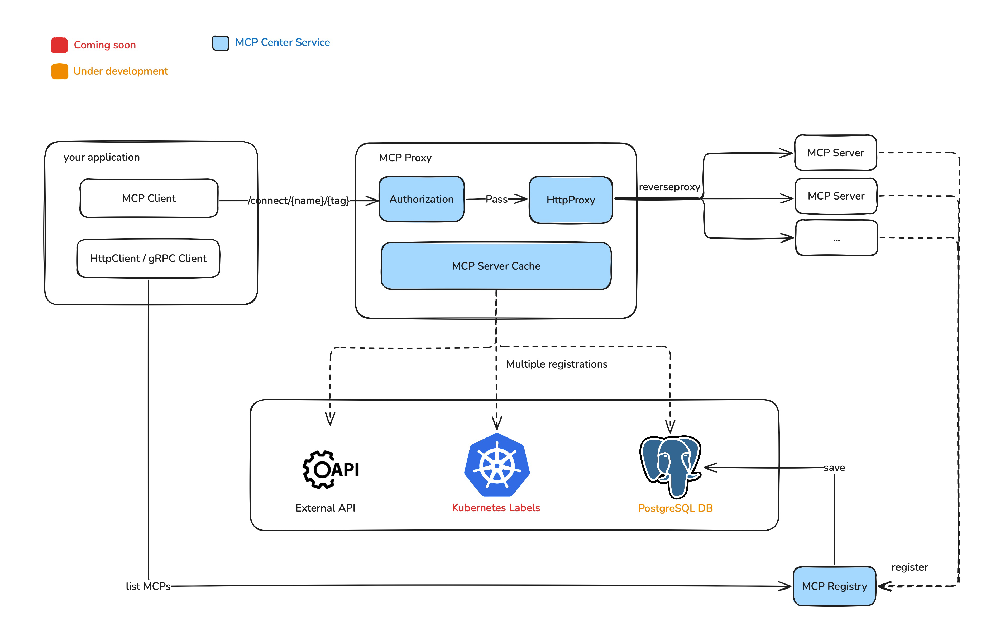

# MCP Center

---


A centralized platform for managing and connecting [MCP](https://modelcontextprotocol.io/) (Model Context Protocol) servers. MCP Center provides a high-performance proxy service that enables seamless communication between MCP clients and multiple MCP servers.

## Motivation

In our Kubernetes cluster, we have deployed various MCP Servers, including both in-house and third-party implementations, each running as independent services. Accessing these services currently requires configuring separate `K8s Ingress` or `Service Gateway` for each MCP Server, which increases operational complexity and maintenance overhead.

To address this, we propose a centralized MCP registry and reverse-proxy service. With this centralized service:
* Service discovery becomes unified, eliminating the need to configure access paths for each MCP Server individually.
* Authentication can be managed consistently across all MCP Servers, enhancing system security.
* Leveraging a plugin system, we can modify or filter MCP Tool parameters, enabling tool-level traceability and monitoring (see issue #7).

This approach improves maintainability and provides a foundation for future features such as unified tracing, auditing, and monitoring.

## Architecture


## Features

- [x] **MCP SSE Transport Proxy** - Server-Sent Events transport support
- [x] **MCP Streamable Transport Proxy** - Streamable transport protocol support
- [x] **Multiple Registry Types** - Support for memory-based and external API registries
- [x] **Session Management** - Configurable session expiration and management for sse connection
- [x] **High Performance** - Built with [Pingora](https://github.com/cloudflare/pingora) proxy framework for optimal performance
- [x] **Kubernetes Ready** - Complete Helm chart for easy deployment

## Quick Start

visit [here](docs/QUICK_START.md) to quick start

### Using Docker

```bash
# Pull the image
docker pull nautilusops/mcp-center:latest

# Run with default configuration
docker run -p 5432:5432 nautilusops/mcp-center:latest

# Run with custom configuration
docker run -p 5432:5432 \
  -v $(pwd)/mcp_servers.toml:/app/mcp_servers.toml \
  nautilusops/mcp-center:latest
```

### Using Helm

```bash
# Clone the repository
git clone https://github.com/your-org/mcp-center.git && cd mcp-center

# Install with default values
helm install mcp-center .helm/mcp-center

# Install with custom values
helm install mcp-center .helm/mcp-center \
  --set replicaCount=2 \
  --set service.type=LoadBalancer \
  --set image.repository=registry.cn-hangzhou.aliyuncs.com/ceerdecy/mcp-center \
  --set image.tag=latest
```

### From Source

```bash
# Clone the repository
git clone https://github.com/your-org/mcp-center.git
cd mcp-center

# Build the project
cargo build --release

# Run the application
./target/release/mcp-center run --config bootstrap.toml
```

## Configuration

### MCP Servers Configuration (`mcp_servers.toml`)

```toml
[[mcp_servers]]
endpoint = "http://127.0.0.1:8080/sse"
name = "example-server"
tag = "1.0.0"

[[mcp_servers]]
endpoint = "http://another-server:8080/sse"
name = "another-server"
tag = "2.0.0"
```

### Environment Variables

| Variable | Default | Description |
|----------|---------|-------------|
| `HTTP_PORT` | `5432` | HTTP server port |
| `GRPC_PORT` | `5433` | gRPC server port |
| `CACHE_REFLASH_INTERVAL` | `3600` | Cache refresh interval in seconds |
| `REGISTRY_TYPE` | `memory` | Registry type (memory/external_api) |
| `EXTERNAL_API` | - | External API endpoint URL |
| `EXTERNAL_AUTHORIZATION` | - | External API authorization token |
| `SERVER_DEFINITION_PATH` | `mcp_servers.toml` | Path to MCP servers definition file |
| `SESSION_EXPIRATION` | `604800` | Session expiration time in seconds |

## Kubernetes Deployment

### Using Helm Chart

The included Helm chart provides a complete Kubernetes deployment solution:

```bash
# Install with custom MCP servers configuration
helm install mcp-center .helm/mcp-center \
  --set mcpServersConfig="
[[mcp_servers]]
endpoint = \"http://your-mcp-server:8080/sse\"
name = \"my-server\"
tag = \"1.0.0\"
"

# Install with external registry
helm install mcp-center .helm/mcp-center \
  --set mcpServersConfig="" \
  --set env[0].name=REGISTRY_TYPE \
  --set env[0].value=external_api \
  --set env[1].name=EXTERNAL_API \
  --set env[1].value=http://your-registry-api
```

### Helm Chart Features

- **ConfigMap Support**: MCP servers configuration via ConfigMap
- **Health Checks**: Configurable liveness and readiness probes
- **Resource Management**: CPU and memory limits/requests
- **Service Types**: Support for ClusterIP, NodePort, and LoadBalancer
- **Ingress Support**: Kubernetes ingress configuration
- **Auto-scaling**: Horizontal Pod Autoscaler support

## API Usage

### Proxy Requests

```bash
# Forward request to MCP server
curl http://{server_host}:5432/connect/{mcp_name}/{mcp_tag}
```

## Development

### Prerequisites

- Rust 1.89.0 or later
- Docker (for containerized builds)
- Kubernetes cluster (for deployment testing)

### Building

```bash
# Development build
cargo build

# Release build
cargo build --release

# Docker build
docker build -t mcp-center .
```

### Testing

```bash
# Run unit tests
cargo test

# Run integration tests
cargo test --test integration

# Run with specific features
cargo test --features integration
```

## Contributing

1. Fork the repository
2. Create a feature branch (`git checkout -b feature/amazing-feature`)
3. Commit your changes (`git commit -m 'Add amazing feature'`)
4. Push to the branch (`git push origin feature/amazing-feature`)
5. Open a Pull Request

## License

This project is licensed under the Apache License, Version 2.0 - see the [LICENSE](LICENSE) file for details.

## Roadmap

- [ ] **MCP Server Registry Center**: Centralized management of MCP server endpoints
- [ ] **Authentication & Authorization**: JWT-based authentication
- [ ] **Metrics & Monitoring**: Prometheus metrics and Grafana dashboards
- [ ] **Load Balancing**: Advanced load balancing algorithms
- [ ] **Rate Limiting**: Request rate limiting and throttling
- [ ] **Plugin System**: Extensible plugin architecture
